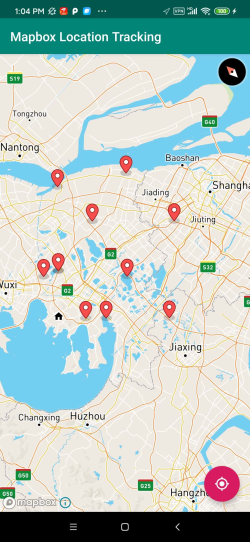

# pdq-logistics
Repository for pdq-logistics sub-system 

## Prerequisites
- Docker & Docker-compose. Download from their official website at https://www.docker.com/

## Repositories
This docker hub repository is located at https://hub.docker.com/repository/docker/oxime/pdq

## Installation
Clone the repository:
```
$ git clone https://github.com/oxime3/pdq-logistics.git
```
## Usage
1. Set a firewall rule to allow connections through port 5000. The API is configured to run on this port, and may be inaccessible otherwise. You may search online for how to accomplish this based on your system. 

2. From the directory containing the `docker-compose.yml` file, run the API and van-module using:
```
$ cd pdq-logistics
$ docker-compose up
```

2. On an android phone, install the apk provided [here](android-apk/pdq-logistics.apk). You may also generate the apk yourself from the source code.

3. Ensure that your phone is on the same internet network as your computer, and then run the app.

4. When prompted, enter the IP address of the computer running the API, for example `168.123.4.111`.

5. You may drag and pinch the screen to move and zoom as desired. Van locations are shown as red markers.


